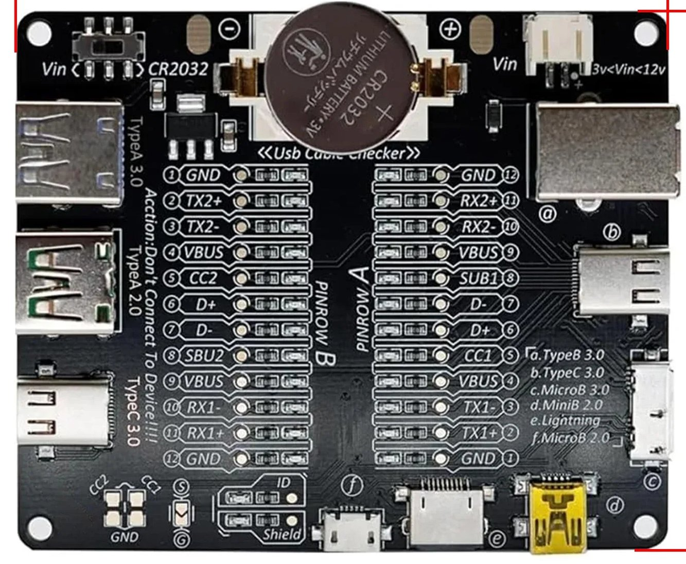

# USB Cable Checker

Simulador web da placa de teste de cabos USB Type-C. Identifique o tipo, qualidade e possíveis defeitos do seu cabo USB — tudo direto no navegador.



## Como Usar

Abra o arquivo `index.html` no navegador — **não precisa de servidor nem de dependências**.

1. **Clique nos LEDs** para ligar/desligar cada pino
2. **Use os atalhos** GND e VBUS para ativar grupos de pinos rapidamente
3. **Selecione um Preset** no dropdown para carregar um padrão conhecido
4. O **painel RESULTADO** mostra em tempo real o diagnóstico do cabo

## Padrões Reconhecidos

| Padrão | Categoria | Descrição |
|---|---|---|
| ⚡ Charge-Only | Funcional | Carregamento simples, sem dados |
| 🔌 USB 2.0 (Type-C) | Funcional | Carga PD + dados até 480 Mbps |
| 🚀 SuperSpeed (USB 3.0+) | Funcional | Alta velocidade até 10 Gbps |
| 💎 Full-Featured (USB4) | Funcional | Suporte total: carga, dados, áudio, vídeo |
| 💀 Defeito (Stub) | Defeituoso | Curto-circuito no barramento de dados |

## Intercambiabilidade

Os pinos **CC1 (A5)** e **CC2 (B5)** são tratados como intercambiáveis automaticamente — a orientação rotacional do cabo no conector determina qual está ativo.

## Como Adicionar Novos Padrões

Edite o arquivo `patterns.js` — copie o template documentado no topo do arquivo, preencha os pinos com `true`/`false` e adicione ao array `PATTERNS`. O sistema detecta automaticamente.

## Estrutura

```
├── index.html      ← Abrir no navegador
├── style.css       ← Visual dark-mode estilo PCB
├── app.js          ← Orquestrador da interface
├── pins.js         ← Definição dos 24 pinos + Shield
├── patterns.js     ← Padrões de cabos (editar aqui)
├── engine.js       ← Motor de matching
└── assests/
    ├── board.jpg       ← Foto da placa física
    ├── pin table.jpg   ← Tabela de pinout
    ├── pinrow.csv      ← Dados dos pinos
    └── cenario.md      ← Cenários de referência
```

## Tecnologia

HTML + CSS + JavaScript puro. Zero dependências. Roda 100% no navegador via `file://`.
